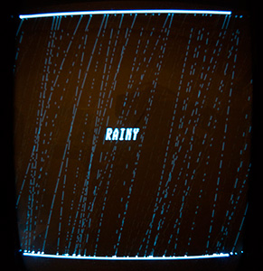

# rainy
Rainy by Frog //ROi 
413 bytes simple rain simulation intro for Vectrex computer 

AS09 Assembler for M6809 v1.41/Win by Frank A. Kingswood was used

If you don't have Vectrex, check out Youtube video: 
http://www.youtube.com/watch?v=MriSTEdnU5U

License: MIT

